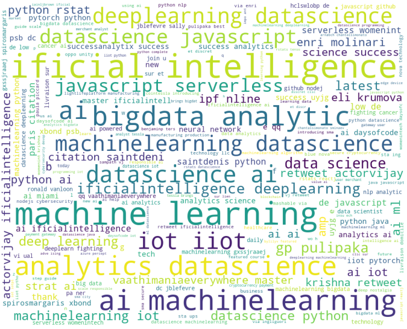
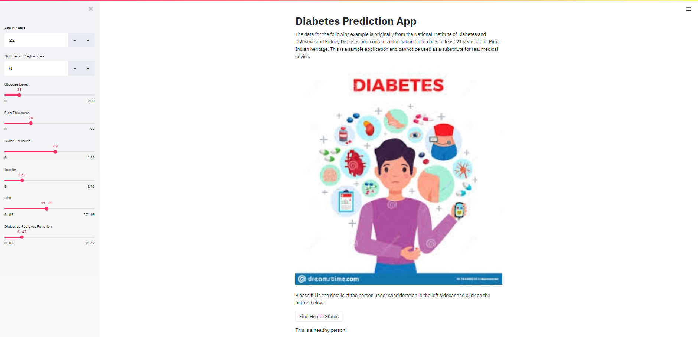
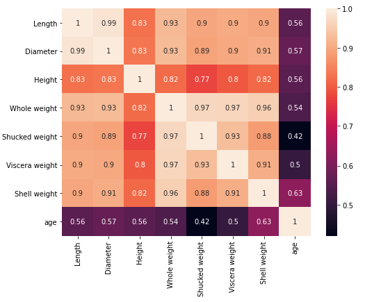

# Sentiment Analysis of Tweets from Mongo using NLP, Machine Learning, and Deep Learning
The main focus of this project was to characterize the sentiments associated with tweets that were scraped relating to machine learning and data science. Upon creating a livestreaming program to scrape tweets and add them to MongoDB, a sentiment analysis was performed using NLTK to return the percentage of positive and negative tweets. Next, the findings were corroborated and refined through Machine Learning (SVM) and Deep Learning (Transformers) methods.

*Technologies and libraries used in repo*: Python, Pandas, Jupyter Notebook, Google Colaboratory, Sklearn, Mongo DB, PyMongo, NLTK, Tweepy, Matplotlib, Seaborn, Numpy, Transformers, TensorFlow, DistilBERT pretrained model, Streamlit, Explainer Dashboard



## What is contained in this repo?

This repository contains multiple secondary projects along with the [**TweepywithMongoDB.ipynb**](TweepywithMongoDB.ipynb) and [**DeepLearning_Model.ipynb**](DeepLearning_Model.ipynb) files that are associated with the Twitter Sentiment Analysis project. The following resources have been made available in this repo:

- **Diabetes Predictor**([*diabetes.ipynb*](Diabetes.ipynb) and [*diabetes-streamlit-2.py*](diabetes-streamlit-2.py))
    - The diabetes project was designed to predict the chance that an individual would be at risk for diabetes based on factors like number of pregnancies, glucose, blood pressure, skin thickness, insulin, BMI, and age.
    - The .ipynb file cleaned the data and performed a Random Forest classifier to the tune of 88% accuracy. 
    - The **diabetes-streamlit-2.py** Python file was created with the Streamlit library to provide a simple interactive web interface made with minimal code.
        - To run this file, input the following command in terminal:
        ```streamlit run diabetes-streamlit-2.py```
        - More infomation on Streamlit [here](https://docs.streamlit.io/en/stable/)
    - From a statistical standpoint, the predictions are not likely to be extremely predictive as they are taken from only females from a specific ethnic group -- a larger, more diverse dataset should be used.



- **GastroGuessr -- Abalone Age predictor**([*Abalone_ML.ipynb*](Abalone_ML.ipynb))
    - This Jupyter Notebook file showcases a custom supervised machine learning algorithm to predict the age of abalone specimins based on other features given.
    - The most valuable preliminary visualization is the Seaborn heatmap of correlations between Age and other measurements. 
    - After preparing the data, two types of machine learning were run on it:
        - __Multivariable Linear Regression__ through Sklearn
        - __Classification ML__ was used in the form of KNN, Decision tree, Random Forest, and SVM.
    - Random forest proved to be the best model to predict age, and it seemed important that all factors provided be considered in the prediction.



- **SLR** ([*SLR.ipynb*](SLR.ipynb))
    - This resource functions as background on the ML topics that were incorporated into the final project, such as:
        - Supervised vs. Unsupervised Learning
        - Linear Regression (single variable and multiple)
        - Polynomial Regression
        - Exponential Regression
        - Sinusoidal Regression
        - Logarithmic Regression
    - There is a plethora of helpful diagrams, images, and notes to explain what is really going on from a mathmatical perspective with these algorithms. 

- **Simple Linear Regression - Classification** ([*Simple_Linear_Regression-Classification.ipynb*](Simple_Linear_Regression-Classification.ipynb))
    - Similar to the SLR file, this image-filled-notebook functions as a resource on classification algorithms.
    - The following machine learning techniques are covered:
        - K-Nearest Neighbors
        - Decision Trees
        - Random Forest
        - Support Vector Machine
        - Naive Bayes
    - [Explainer Dashboard](https://explainerdashboard.readthedocs.io/en/latest/explainers.html) is used in this notebook to open up a Dash-based web page depicting a multitude of ML visualizations. Simply run the code within Jupyter Notebook or similar services to use.

## Back to the main project...

To summarize once again, the idea was to do Twitter sentiment analysis with Natural Language Processing using the NLTK library with Python. The Tweepy Python Library was used to access Twitter API, and once tweets were collected, Mongo DB stored them. Next, the data was prepared for NLP analysis as positive/negative. Following that, a Support Vector Machine (SVM) model using a bag of words approach was run to classify the data given the result from NLTK. In order to increase precision in the model, a deep learning approach was taken in the [**DeepLearning_Model.ipynb**](DeepLearning_Model.ipynb) file. The [🤗 Transformers](https://huggingface.co/transformers/quicktour.html) library provided a pre-trained sentiment model which was used in conjunction with TensorFlow Eager Executeion to fine tune the approach. 


You can find our clean dataset that was used for ML/DL [here](new_df.csv)